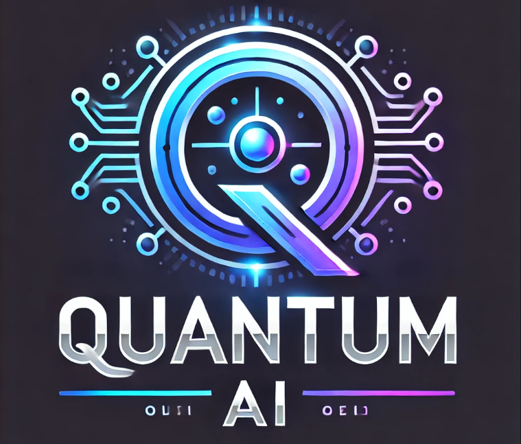

# Cold Email Generator for Quantum AI



## Overview
The Cold Email Generator for Quantum AI is a web application designed to automate the creation of tailored cold emails for business development and outreach. It leverages the advanced **Llama 3.1-70B Versatile** model through the ChatGroq API to extract job descriptions from career pages and generate personalized email content. The tool includes a portfolio management system using ChromaDB to dynamically incorporate relevant project links into the emails, ensuring highly targeted and professional communication.

## Features
- **Automated Email Generation**: Generates personalized cold emails using AI.
- **Web Scraping**: Extracts job descriptions and relevant details from career pages.
- **Portfolio Integration**: Dynamically includes relevant project links based on the job description.
- **Customizable Options**: Users can select email tone and enable advanced features.
- **User-Friendly Interface**: Built with Streamlit for an intuitive and responsive UI.

## Tech Stack
- **Frontend**: Streamlit
- **Backend**: Python
- **AI Model**: Llama 3.1-70B Versatile via ChatGroq API
- **Database**: ChromaDB for portfolio management
- **Other Tools**: LangChain, Pandas, UUID

## Installation

1. **Clone the Repository**:
   ```bash
   git clone https://github.com/yourusername/cold-email-generator.git
   cd cold-email-generator
   ```

2. **Create a Virtual Environment**:
   ```bash
   python -m venv venv
   source venv/bin/activate  # On Windows: venv\Scripts\activate
   ```

3. **Install Dependencies**:
   ```bash
   pip install -r requirements.txt
   ```

4. **Set Up Environment Variables**:
   - Create a `.env` file in the root directory.
   - Add your ChatGroq API key:
     ```
     GROQ_API_KEY=your_groq_api_key
     ```

5. **Prepare Portfolio Data**:
   - Place your portfolio data in `resource/my_portfolio.csv` with columns:
     - `Techstack`
     - `Links`

6. **Run the Application**:
   ```bash
   streamlit run main.py
   ```

## Usage

1. Launch the application by running the above command.
2. Enter the URL of a job posting or target website.
3. Select email tone and enable advanced features (optional) from the sidebar.
4. Click the **Generate Email** button to create a tailored cold email.
5. View or copy the generated email from the output text area.

## File Structure
- **main.py**: Contains the Streamlit app logic and UI layout.
- **chains.py**: Defines the AI-powered workflows for extracting job details and generating emails.
- **portfolio.py**: Handles portfolio data loading and querying using ChromaDB.
- **utils.py**: Utility functions for text cleaning and processing.
- **resource/my_portfolio.csv**: Portfolio data file.

## Future Enhancements
- Add multi-language support for email generation.
- Implement user authentication and saved sessions.
- Expand portfolio querying to include more complex matching algorithms.
- Optimize AI model integration for faster response times.

## Contributing
Contributions are welcome! Please follow these steps:
1. Fork the repository.
2. Create a new branch for your feature or bug fix.
3. Commit your changes and push to your branch.
4. Open a pull request for review.

## License
This project is licensed under the [MIT License](LICENSE).

## Acknowledgements
- [LangChain](https://github.com/langchain-ai/langchain) for simplifying AI model integration.
- [Streamlit](https://streamlit.io/) for providing a user-friendly UI framework.
- [ChatGroq](https://groq.com/) for API access to the Llama 3.1-70B Versatile model.
- [ChromaDB](https://www.trychroma.com/) for efficient vector database management.

---

**Developed by [Elisha Aura](https://yourportfolio.com)**

