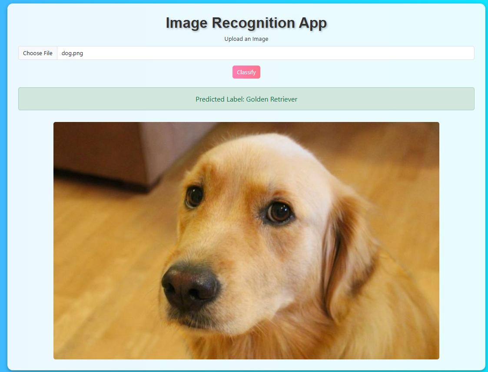

# Image Recognition Web App

This project is an end-to-end image recognition web application that allows users to upload an image and get its classification using a pre-trained ResNet-101 model. The app is built with Flask, PyTorch, and Bootstrap, and deployed on a cloud platform for real-world accessibility.

---

## Features

- **Deep Learning Model**: Utilizes ResNet-101 pre-trained on ImageNet for image classification into 1,000 categories.
- **User-Friendly Interface**: Allows users to upload images via a simple web interface.
- **Real-Time Inference**: Processes and predicts the uploaded image label instantly.
- **Cloud Deployment**: Accessible online to showcase machine learning capabilities.

---

## Tech Stack

- **Backend**: Flask (Python)
- **Machine Learning**: PyTorch, torchvision
- **Frontend**: HTML, CSS (Bootstrap)
- **Deployment**: Render/Heroku (or any cloud platform)

---

## Getting Started

### Prerequisites

Ensure you have Python 3.8 or later installed, and the following libraries:

- Flask
- torch
- torchvision
- Pillow

Install the dependencies using pip:

```bash
pip install flask torch torchvision pillow
```

---

### Running Locally

1. **Clone the Repository**:
   ```bash
   git clone https://github.com/your-username/image-recognition-webapp.git
   cd image-recognition-webapp
   ```

2. **Run the Application**:
   ```bash
   python app.py
   ```

3. **Access the Web App**:
   Open your browser and go to `http://127.0.0.1:5000/`.

---

## Project Structure

```plaintext
├── app.py                # Main Flask application
├── templates/
│   └── index.html        # Frontend HTML file
├── static/
│   └── styles.css        # Optional custom styles
├── requirements.txt      # Python dependencies
├── Procfile              # Deployment file for Heroku
└── README.md             # Project documentation
```

---

## Deployment

1. **Prepare for Deployment**:
   - Create a `requirements.txt` file:
     ```bash
     pip freeze > requirements.txt
     ```
   - Add a `Procfile` with the following content:
     ```plaintext
     web: gunicorn app:app
     ```

2. **Deploy to Heroku**:
   ```bash
   git init
   heroku create
   git add .
   git commit -m "Initial commit"
   git push heroku main
   ```

3. **Access Your App**:
   Visit the URL provided by Heroku after deployment.

---

## Example Use Case

- Upload an image of a dog, and the app will classify it as a "golden retriever" or another breed from the ImageNet classes.

---

## Screenshots

### Home Page


### Prediction Result


---

## Future Improvements

- Add support for multiple models.
- Enable fine-tuning for custom datasets.
- Enhance frontend design.
- Optimize for faster inference.

---

## License

This project is licensed under the MIT License - see the [LICENSE](LICENSE) file for details.

---

## Acknowledgments

- [PyTorch Documentation](https://pytorch.org/docs/)
- [Flask Documentation](https://flask.palletsprojects.com/)
- [Bootstrap](https://getbootstrap.com/) for UI components.

---

## Author

**Elisha Aura**  
[GitHub](https://github.com/ellysher) 
